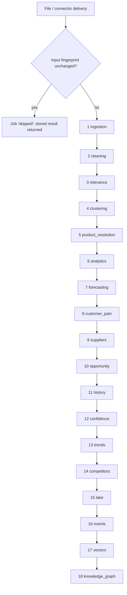

# Data Flow

How one uploaded file becomes market intelligence. There are 18 stages, run by
`dip.pipeline.runner.process_dataset` as a tracked job. Each stage records its duration, peak
memory and a summary on the job, so the Data Operations page shows live progress.



## Before stage 1: incremental check

The job computes a fingerprint from everything the result depends on:

- file content
- snapshot date
- marketplace
- review file
- human relevance corrections
- the supplier list as entered
- configuration
- code version

If the market's stored result carries the same fingerprint, the job ends with a single `skipped`
stage. Re-uploading an unchanged file therefore costs about 0.03 s. `force=true` re-runs anyway.

## Stages

| # | Stage | Input → output | Kept where |
|---|---|---|---|
| 1 | ingestion | Any CSV/TSV/XLSX/JSON/JSONL is schema-detected (SellerSprite adapter or auto-detect) into universal records with a `record_id`. Hard rejections get reasons: missing title or price, invalid price or ASIN, duplicate, impossible sales. | `lake/raw/` (as received), dataset row + ingestion report |
| 2 | cleaning | v1 quality checks give each record `data_confidence` 0–100 and `quality_issues`: missing fields, duplicates, rule checks, IQR, robust-z and Isolation-Forest outliers. Records under 40 are flagged, not dropped. | on every record |
| 3 | relevance | A dental relevance score with a per-signal explanation (title, category, image words). Human corrections override it. Unique texts are scored once; texts seen before under the same model come from the relevance cache. | on every record; `lake/cache/relevance/` |
| 4 | clustering | Families and segments are discovered with class-TF-IDF labels. Above 5,000 listings, discovery fits on a sample and assigns the rest by nearest centroid. | on current listings |
| 5 | product_resolution | Listings are resolved into the Product Master: several listings, one product. The best-selling listing is marked; merge edges are kept. | `products`, `dedup_pairs` |
| 6 | analytics | Market capacity per segment: revenue, sales, price tiers, HHI, top brands, coverage. | `segments` |
| 7 | forecasting | Ensemble forecast (MA, Holt, ARIMA, regression) when there are 3 or more periods; horizon labels; launch cohort. | `forecasts` |
| 8 | customer_pain | Review aspects give complaints, advantages and missing features per market, segment and product. Only runs when review text exists. | `pain` |
| 9 | suppliers | Imported suppliers are scored and matched to segments. | `supplier_matches`, supplier scores |
| 10 | opportunity | v2 opportunity = demand + growth + pain + competition gap + supplier − difficulty. The score shrinks toward 50 with missing evidence. Models and variants are assigned and the galaxy layout computed. | `segments`, `products` |
| 11 | history | Listing history: this upload plus every earlier upload of the market (std zone), one row per listing and period. Only accepted, relevant, usable records count. | in memory |
| 12 | confidence | Product confidence (source, completeness, verification, history) with reasons, rolled up to segment and market. | `products`, `segments`, market summary |
| 13 | trends | Trend, confidence, expected growth, price pressure and seasonality per market and segment. | `trends`, `segments` |
| 14 | competitors | Brand profiles and changes between the last two periods. | `competitors` |
| 15 | lake | Every record, with its `excluded_reason` if excluded, is written to the std zone. Curated tables are written for the market. | `lake/std/`, `lake/curated/` |
| 16 | events | Change detection against the market's previous state produces events. Notice and important events become alerts to the owners of the market's categories. | `events`, `alerts` |
| 17 | vectors | Product embeddings go to Qdrant for similarity and search. | vector store |
| 18 | knowledge_graph | The market's subgraph is replaced: categories, families, segments, products, listings, brands, sellers, suppliers, countries and customer problems. | graph store |

At the end, the market summary is saved to `markets.summary`. It covers ingestion, quality,
relevance, discovery, dedup, category metrics, forecast, trend, confidence, competitors, pain,
suppliers, opportunity, owners and the fingerprint. Brands and owners are synced to the business DB.

## Nothing is silently discarded

Every raw row stays in `lake/raw/`. Every record, including rejected, irrelevant, low-quality and
older-snapshot ones, stays in `lake/std/`, and each excluded record carries its reason:

- `rejected: …`
- `not relevant: …`
- `low data quality: …`
- `older snapshot (history only)`

The records API (`/markets/{m}/records?status=excluded`) returns them. `data/raw/` (the v1 source
exports) is never written to.

## History across uploads

Each upload of a market is kept, so the second upload of a market automatically adds:

- historical consistency to confidence
- revenue growth, price movement and review velocity to trends
- change events to competitors

Periods come from the dataset's `snapshot_date` (the upload date when none is given) or from a
timestamp column inside the file. `dmis.py process-dir FOLDER --market M` loads a folder of monthly
exports oldest first, reading snapshot dates from file names such as `micromotor_2025-03.xlsx`.

## Live sources (event-driven path)

```text
connector poll ──► dataset.available ──► processed as the market (same 18 stages) ──► change events ──► alerts
supplier feed  ──► suppliers table ──► supplier.added ──► matches refresh on the next run
news feed / POST /events ──► news.item matched to markets by text ──► alerts to owners
```

## Reading the data

- The API reads curated tables through DuckDB (`lake.read_curated`).
- Heavy read endpoints are cached per data version.
- Cross-market analytics query `curated/<table>/*/data.parquet` directly.
