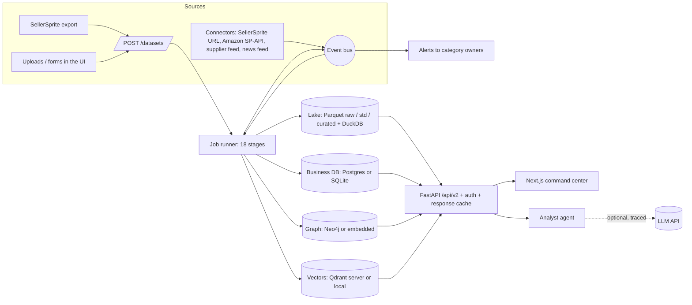

# System Architecture — DMIS Intelligence Platform (final)

DMIS turns marketplace exports (SellerSprite today; APIs through connectors) into market
intelligence a product team can act on: which products to develop, which markets grow, who the
competitors are, who can manufacture, what a launch would do, and what each employee should focus on.

It is built in three layers. Each layer wraps the one below it and never replaces it.

| Layer | Package | Role |
|---|---|---|
| Intelligence Core v1 | `src/dmie/` | Deterministic algorithms: schema detection, quality, relevance, discovery, dedup, market metrics, forecasting, opportunity, pain, Monte-Carlo simulation, recommendations |
| Platform v2 | `src/dip/` (`pipeline/`, `storage/`, `api/`) | Staged job runner, scale paths (Polars, sampled discovery, blocked dedup), storage adapters, REST API, auth |
| Enterprise layer | `src/dip/intelligence/`, `src/dip/events.py`, `src/dip/connectors.py`, `src/dip/cache.py` | Confidence, hierarchy, trends, competitors, launch evaluation, analyst, employee briefs, events and alerts, connectors, incremental processing |
| Command center | `frontend/` (Next.js 16, React 19, R3F, Sigma, ECharts, Tailwind) | 3D globe / universe / galaxy, graph explorer and decision pages |

## Component diagram

## Storage

Every external service is optional. When a service's variable is unset, an embedded fallback
under `data/platform/` takes its place, so the platform runs on a laptop and scales by configuration.

| Store | Server mode (env var) | Embedded fallback | Holds |
|---|---|---|---|
| Business DB | PostgreSQL (`DIP_POSTGRES_URL`) | SQLite `data/platform/business.db` | users, api_tokens, permissions, employees, categories, ownership, companies, suppliers, datasets, jobs, markets (summary JSON), events, alerts, ai_traces |
| Lake | Parquet under `DIP_LAKE_DIR`, queried with DuckDB | `data/lake/` | `raw/` exactly as received, `std/` every record of every upload with reasons, `curated/<table>/market=<m>/` current state, `cache/relevance/` |
| Analytics DB | DuckDB (`DIP_DUCKDB_PATH`) | `data/platform/analytics.duckdb` | human relevance corrections, snapshot history |
| Graph | Neo4j (`DIP_NEO4J_URI`) | NetworkX + DuckDB | knowledge graph (below) |
| Vectors | Qdrant server (`DIP_QDRANT_URL`) | Qdrant local mode | 256-d hashed product embeddings, market payloads |

The curated tables per market are:

- `records`
- `listings`
- `products`
- `segments`
- `families`
- `forecasts`
- `pain`
- `supplier_matches`
- `dedup_pairs`
- `trends`
- `competitors`

## Knowledge graph model

| Node | Edges |
|---|---|
| Industry, Industry branch | `BELONGS_TO` |
| Category (market) | `HAS_FAMILY` → ProductFamily, `BELONGS_TO` → branch |
| ProductFamily | `HAS_SEGMENT` → Segment |
| Segment | `HAS_MODEL` → Product, `SUPPLIED_BY` → Supplier, `HAS_PROBLEM` → CustomerProblem |
| Product (= variant) | `MADE_BY` → Brand, `HAS_LISTING` → Listing, `PRODUCT_SIMILAR_TO`, `COMPETES_WITH`, `HAS_PROBLEM` |
| Listing | `SOLD_BY` → Seller |
| Supplier | `LOCATED_IN` → Country |

## Product hierarchy

`Category → Family → Segment → Model → Variant → Listing`, all discovered from the data:

- **Families and segments** come from v1 discovery: K-Means families, DBSCAN or K-Means segments, and class-TF-IDF labels.
- **Models** come first from a shared specification signature (rpm, W, V, pack, ml, g, model tokens). Products without one are clustered by title similarity within their segment. `model_basis` records which rule applied: `spec`, `text` or `none`.
- **Variants** are Product Master entities (the listings that are one real product). Each is labelled with what distinguishes it inside its model.
- **Listings** are ASINs. The best-selling listing of each product is marked.

Thresholds are in `config/platform/hierarchy.yaml`.

## Intelligence modules (enterprise layer)

| Module | Answers | Method (config) |
|---|---|---|
| `confidence.py` | "How far can I trust this number?" | Score = weighted source reliability + completeness + verification + historical consistency. Missing components are left out and the score is capped. Rolled up revenue-weighted to segments and markets (`confidence.yaml`). |
| `history.py` | Listing history across uploads | Stitches the std zone of every upload by listing id, with one period per dataset or in-file snapshot date. |
| `trends.py` | "Which markets are growing?" | Direction is a weighted mean of four signals: • demand history • listing growth • new-entrant revenue share • review velocity Price movement is also reported. Seasonality is computed from 24 months of data. Confidence = evidence base × agreement × coverage. "Declining" requires demand evidence (`trends.yaml`). |
| `competitors.py` | "Who are our competitors?" | Each brand gets a position, share, price index, rating gap, breadth, launch activity and review complaints. These produce weaknesses and the opportunity each leaves open. Changes between the last two periods are tracked (`competitors.yaml`). |
| `launch.py` | "What happens if we launch this?" | Fit is scored on demand, growth, competition, price, pain, suppliers and differentiation. Then risks, attractiveness, positioning, strategy, unit economics (from the comparables' cost and FBA fields) and the v1 Monte-Carlo (`launch.yaml`). |
| `briefs.py` | "What should each employee focus on?" | A market brief and a prioritised action list per employee. |
| `analyst.py` | Natural-language questions | Intent + scope resolution (branch, market, segment, brand, employee, product similarity) → deterministic tools → cited answer. An optional LLM rewrite is logged in `ai_traces` (`analyst.yaml`). |
| `events.py` | "What changed?" | Event log + in-process bus. After each run, change detection compares the new market state with the old one. `notice` and `important` events become alerts for category owners. |
| `connectors.py` | Live data | Registry: SellerSprite export URL, Amazon SP-API (credentials report), supplier feed, news feed (RSS/Atom). Each source is enabled by environment variables. |
| `cache.py` | Speed | Input fingerprint skip, relevance cache by text + model fingerprint, and a read-API cache keyed on the data version and the caller's market scope. |

## Security and access

- **Tokens:** bearer tokens (`dmis_…`) are stored only as SHA-256 hashes. Every route declares `require(resource, action)`, with levels read < write < admin.
- **Roles:**

  | Role | Access |
  |---|---|
  | admin | everything |
  | manager | read and write on markets, suppliers, datasets and people |
  | product_manager | only the markets of their linked employee's categories, enforced on every route that names a market and on the market lists |
  | analyst | reads markets, suppliers and people; can upload datasets |
  | viewer | read only on markets, suppliers and people |
  | customer | shopping only |

- **Enforcement:** controlled by `DIP_AUTH=on|off`; the default is on when PostgreSQL is configured.
- **AI:** only when a caller requests it and a key is configured. The model receives computed facts only, and every call is traced.

## Scale

Scaling rules:

- **Ingestion:** Polars lazy scans with vectorised parsing and rejection rules.
- **Large markets:** above 5,000 current listings, discovery fits on representatives plus a 20k sample, and dedup uses blocked TF-IDF kNN. Both preserve v1's rules.
- **Forecasting:** a process pool.
- **Incremental work:** unchanged inputs are skipped, and texts already seen reuse their relevance scores.

Measured:

| Rows | Full pipeline | Peak memory |
|---|---|---|
| 1M | 80.7 s | 3.5 GB |
| 100k | 22–24 s | — |

The 100k figure includes the enterprise stages.

## Known limits

- Graph explorer, geo map and top-brand leaderboard are organisation-wide views; they are not scoped for product managers.
- There is no multi-tenant data isolation.
- Suppliers and reviews exist only when imported. They are never generated.
- Trends need at least two snapshots for a growth number.
- The Amazon SP-API connector is not wired to a vendor SDK.
- The 3D galaxy has no level-of-detail sampling above 10⁵ products.
